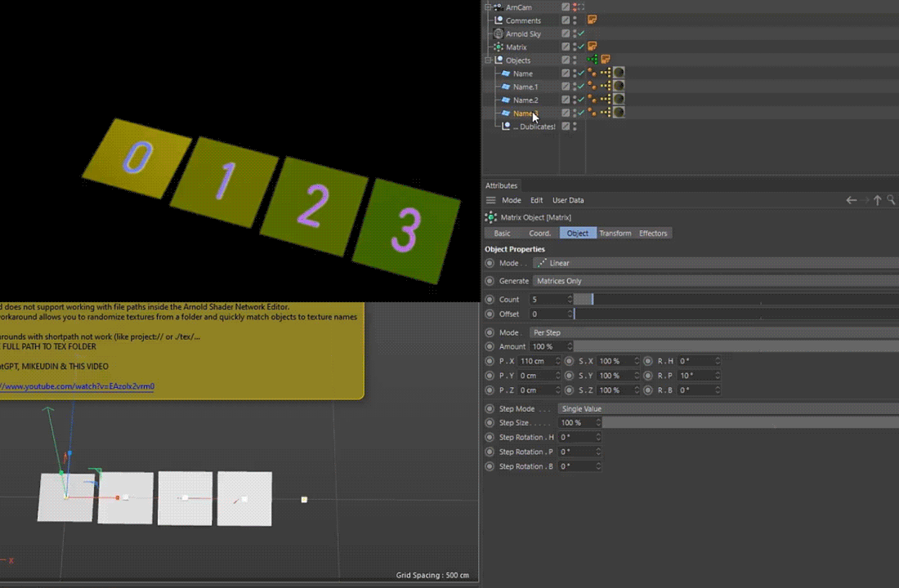

# 🎛️ ARND_STRING_ATR_EXT_1.c4d

🔧 **Extended Workflow for Arnold String Attribute in Cinema 4D**  
_Based on [this method](https://www.youtube.com/watch?v=EAzoIx2vrm0)_

This setup automates texture path assignment for **Arnold** in **Cinema 4D**, designed to streamline workflows with **Substance Painter** and batch texture assets.

📦 [Download ARND_STRING_ATR_EXT_V2.zip](https://raw.githubusercontent.com/AleksandrovskyV/Cinema4D-Projects/main/!ZIP_ARHIVES/ARND_STRING_ATR_EXT_V2.zip)   
Ready-to-use `.c4d` project in zip with texture setup

---

### ✨ Key Features
- 🎲 Random textures from a selected folder for Arnold Render   
- 🎯 Allows manual selection of a specific texture via index  
- 🧠 Uses String-type User Data for dynamic path control  
- 🧩 Clean Xpresso-based logic, easy to extend

---

### 🛠 How to Set Up
1. Create a new object  
2. Go to:  
   `User Data > Add User Data > Load Preset (ARND_STRING_ATR) > OK`  
3. Copy the **yellow Xpresso tag** from the provided example object  
4. Make sure your textures are named numerically (e.g. `BaseColor_01.jpg`, `BaseColor_02.jpg`)

Tip: Use **Adobe Bridge** or similar tools for batch renaming.

---

### 🗂 Example Use Cases
- Random texture assignment for multiple clones or assets / meshes 
- Quick material variations without duplicating shaders  
- Ideal for look-dev and asset iteration workflows

---

### 🏷 Tags
`cinema-4d` `c4dtoa` `arnold` `xpresso` `user-data` `string-attribute` `texture-randomizer` `user_data_string`  
`Mutli Shader Arnold` `user_data_string random` `Random Textures from Folder in Arnold Shader`   
`substance-painter` `workflow-tools` `shader-automation` `cg-tools` `aleksandrovsky` `gpt-assisted`

---

> Assembled by [AleksandrovskyV](https://github.com/AleksandrovskyV), with assistance from GPT.  
> Feel free to fork, break, or improve this setup 🔧
