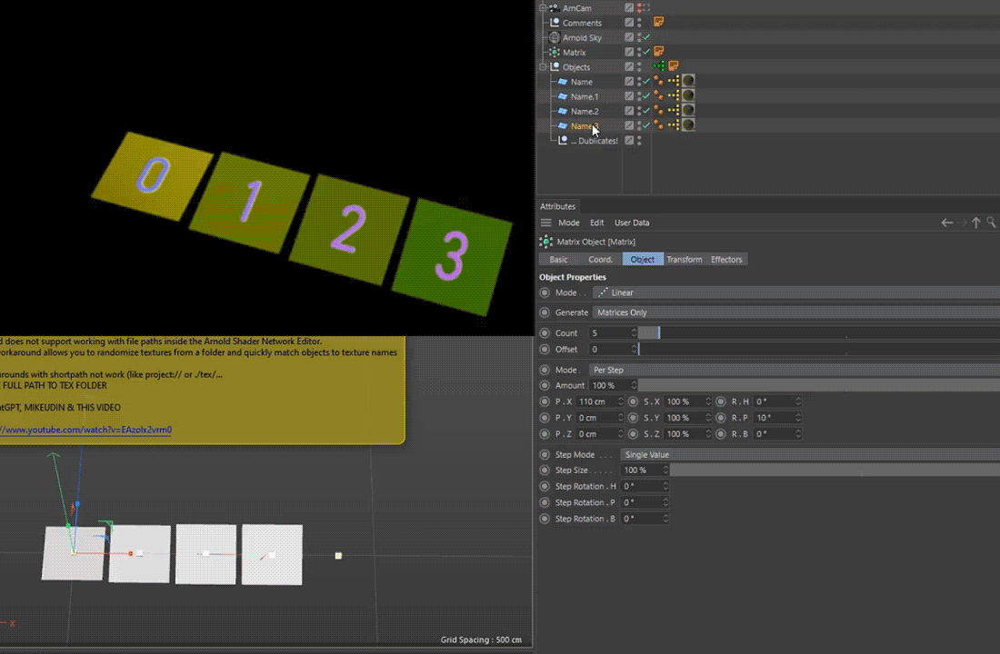

# 🎬 Cinema4D-Projects

Hey dudes. W*lcome [0]

---

## 🔹 [ARND_STRING_ATR_EXT](https://github.com/AleksandrovskyV/Cinema4D-Projects/tree/main/ARND_STRING_ATR_EXT)

> Extend workflow with Arnold String Attribute  
> _Based on [this method](https://www.youtube.com/watch?v=EAzoIx2vrm0)_

- 🎲 Randomizes Arnold textures from a selected folder  
- 🎯 Allows manual texture selection  

# 🎬 Cinema4D-Scripts

Hey dudes. W*lcome [1]
##> 🔹 [SCRIPT FOLDER](https://github.com/AleksandrovskyV/Cinema4D-Projects/tree/main/SCRIPTS_FOLDER)

---

## 🔹 [CAM_MLinkScript / R20+](https://github.com/AleksandrovskyV/Cinema4D-Projects/blob/main/SCRIPTS_FOLDER/CAM_MLinkScript.py)  

> Instantly duplicates the active camera to the top level of your scene.
> Optionally adds a custom Xpresso setup with an Extend parameter to expand the render area while maintaining the original focal length.

- 🎯  Perfect for working with nested or heavy rigs — especially useful for baking or using scripts that require a standalone camera.
- 🧩 Automatically creates an extended render setting with sensor-based scaling, allowing for a wider frame — ideal for post-production workflows (e.g., After Effects).
- 🗑 One-click remove the generated camera, Xpresso tag, and render settings.
